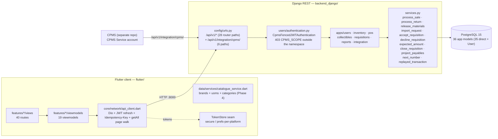

# SYSTEM ATLAS — BuildPro POS / Inventory System

> **Generated:** 2026-10-15 · **Refreshed:** 2026-11-08 · **Branch:** `feat/pos-evolution-phase-1b` (base `fa0f342`). **Status:** Phase 1b Done 2026-11-08 with explicitly owner-accepted QA limits. Source reviews, automated gates and core isolated live QA passed; missing checks remain unverified. Contract v0.2 stays provisional. Not deployed. Canonical progress/evidence: [Phase 1b plan](../planning/pos-evolution/phase-1b-plan.md).
> **Method:** Phase 1b lifecycle, current counts and related stale cross-references checked against source — route tables, model bases, serializers, services and viewmodels. Historical unrelated debt/study notes retained, not newly QA-verified. `README.md`, `PHASE_*.md` and `ENDPOINTS.md` were **not** treated as source truth.
> **Companion:** [`docs/system-atlas.html`](./system-atlas.html) — interactive cockpit (KPIs, filterable Truth Matrix, guided study path).

---

## 1. Architecture

Two processes, one database. A Flutter client talks to a Django REST API; the API owns **all** business logic and persists to PostgreSQL 15. Data screens read API responses; settings constants and access-scope banners remain static (not Live API rows) — zero `*MockData`/`Simulator` files remain in `lib/` (both deleted; only comments reference the mock era). The server is the trust boundary: Phase 1 (server price/UOM authority, `INVALID_SALE` validation, credit-limit block, locked `DocumentCounter`, `Idempotency-Key` de-dupe) · Phase 2 (Admin-group authority + `LAST_ADMIN`, cashier-own scoping, token secrecy) · Phase 3 (open-shift gate, debt-first returns with `RETURN_CREDIT`) · Phase 4 (catalog persistence, two-step receive+process, append-only records) · Phase 5 (`IsUserManagerRole`: Store Manager user-write with `USER_ADMIN_FORBIDDEN` guardrails, manager-only unlinked returns) · Phase 6 (unique `barcode_qr` per selling unit — factory EAN/UPC GS1-checked or auto-derived `QB` code; `?barcode=` lookup; till scans resolve the unit with server fallback; 50×30 mm Code 128 stickers from Products + Receiving; per-unit code edit) · POS evolution Phase 1 (`CPMS Service` role behind `CpmsFencedJWTAuthentication`: 403 `CPMS_SCOPE` outside `/api/v1/integration/cpms/`; CPMS pushes approved requests, imported contents stay read-only). Phase 1b adds the store's separate Accept/Decline decision before release; only accepted lines can leave, `PARTIAL` keeps the token alive, and utang carries the project. Contract for CPMS: [`docs/integration/CPMS-CONTRACT.md`](./integration/CPMS-CONTRACT.md) (v0.2, owner provisionally accepted 2026-11-08; phase closed with accepted QA limits).


```mermaid
flowchart LR
  subgraph Client["Flutter client — flutter/"]
    UI["features/*/views<br/>40 routes"]
    VM["features/*/viewmodels<br/>19 viewmodels"]
    NET["core/network/api_client.dart<br/>Dio + JWT refresh + Idempotency-Key + getAll page walk"]
    CAT["data/services/catalogue_service.dart<br/>brands + uoms + categories (Phase 4)"]
    SEC["TokenStore seam<br/>secure / prefs-per-platform"]
    UI --> VM --> NET
    NET -. tokens .-> SEC
  end
  subgraph Server["Django REST — backend_django/"]
    URLS["config/urls.py<br/>/api/v1/* (28 router paths)<br/>+ /api/v1/integration/cpms/ (6 paths)"]
    AUTH["users/authentication.py<br/>CpmsFencedJWTAuthentication<br/>403 CPMS_SCOPE outside the namespace"]
    APPS["apps/users · inventory · pos<br/>collectibles · requisitions · reports · integration"]
    SVC["services.py<br/>process_sale · process_return · release_materials<br/>import_request · accept_requisition · decline_requisition<br/>expected_amount · close_requisition · project_payables<br/>next_number · replayed_transaction"]
    URLS --> AUTH --> APPS --> SVC
  end
  CPMS["CPMS (separate repo)<br/>CPMS Service account"]
  DB[("PostgreSQL 15<br/>36 app models (35 direct + User)")]
  NET -- "HTTP :8000" --> URLS
  CPMS -- "/api/v1/integration/cpms/" --> URLS
  SVC --> DB
```

**Request lifecycle.** The two oldest paths, plus the Phase 1 checkout contract:

```text
login_page → AuthViewmodel → AuthService → POST /api/v1/auth/login/ → SimpleJWT
products_page → ProductsViewmodel → InventoryViewmodel.load() → GET /products/ + /batches/
checkout → PosTransactionViewmodel (owns attempt key) → POST /transactions/ [Idempotency-Key]
  → process_sale: validate → shift gate → server price → base_qty × CF → FIFO → receipt
```

`InventoryViewmodel` is the product list's **only** home (decisions 11/12).

### Phase 1b — project request lifecycle

- Import → `WAITING` (line `available=null`). CPMS approval is not store acceptance. Store Manager/Admin answers once: `ACCEPTED` with every line explicitly true/false and at least one true, or whole `DECLINED` with a reason. Strict JSON booleans only; false requires a trimmed reason, true requires no reason; unexpected fields and quantity/price/status edits are refused. Accept reserves no stock and books no money.
- `available` is three-valued **store intent**, not live shelf `availability`. False lines never consume stock or hold completion open. Only `ACCEPTED`/`PARTIAL` releases; all eligible lines finished → `RELEASED`, even with truthful outstanding quantities on false lines. `WAITING`/`DECLINED` scans return typed `REQUISITION_<STATUS>` before generic token-used checks.
- Accept/Decline/Close/Release share token→request row-lock order and re-read fresh state. `PARTIAL` keeps the token live; `RELEASED`/`DECLINED`/`CLOSED` spend it. CPMS may close `WAITING`/`ACCEPTED`/`PARTIAL`; closing terminal states is a no-op (legacy `CANCELLED` remains 409).
- Nullable persisted `released_amount` accumulates known **persisted sale totals** only. `expected_amount` = known released total + sum(current selling price × true-line outstanding), outstanding sum rounded once `ROUND_HALF_UP`. It is a live budget, independent of debt/payments, not a quote. Unknown historical totals stay null across future releases; WAITING/DECLINED/unreviewed legacy rows have no budget. CLOSED after acceptance retains abandoned accepted shortfall; CLOSED before review stays null. CPMS read-back adds decisions/reasons/budget, not unit prices, stock or token.
- Two new URLs, one shared queue body/VM: `/admin/project-requests` (sidebar **7**) and `/sales/project-requests` (**8**), appended without renumbering; `salesTwinOf` keeps managers in their shell. CPMS approver stays separate from store reviewer/audit. Old approvals URLs and foreman stay retired.
- Queue is oldest-first, selected-status page walk with a fail-loud **40 × 50 = 2000-row** bound; not a silent completeness claim. Badge uses server `Paged.total` for all WAITING, independent of search/status selection; failed reads are not zero. Unknown write outcomes/unreadable successes and 409 reload authoritative detail before retry; failed refresh blocks actions. Latest-generation reads and dispose-safe notifications guard async state; saved-but-stale copy distinguishes success from refresh failure.

Sources: [services](../backend_django/apps/requisitions/services.py), [review serializers](../backend_django/apps/requisitions/serializers.py), [views](../backend_django/apps/requisitions/views.py), [queue VM](../flutter/lib/features/requisitions/viewmodels/project_requests_viewmodel.dart), [service](../flutter/lib/data/services/requisition_service.dart), [role shells](../flutter/lib/features/requisitions/views/project_requests_page.dart), [routes](../flutter/lib/routes/routes.dart).

---

## 2. Data model

Core erDiagram, derived from actual `ForeignKey`/`OneToOneField` declarations. Phase 1 additions marked ★.

```mermaid
erDiagram
  Category       ||--o{ Product : "category"
  Brand          ||--o{ Product : "brand"
  UnitOfMeasure  ||--o{ ProductVariant : "base_uom"
  Product        ||--o{ ProductVariant : "product"
  ProductVariant ||--o{ VariantUOM : "variant"
  UnitOfMeasure  ||--o{ VariantUOM : "uom"
  ProductVariant ||--o{ InventoryBatch : "variant"
  ProductVariant ||--o{ StockAdjustment : "variant"
  ProductVariant ||--o{ SystemAlert : "variant"
  Supplier       ||--o{ PurchaseOrder : "supplier"
  PurchaseOrder  ||--o{ POItem : "po"
  PurchaseOrder  ||--o{ GoodsReceipt : "po"
  GoodsReceipt   ||--o{ GoodsReceiptItem : "★ lines"
  POItem         ||--o{ GoodsReceiptItem : "po_item"
  ProductVariant ||--o{ POItem : "variant"
  GoodsReceipt   ||--o{ InventoryBatch : "receipt"
  Customer       ||--o{ Quotation : "customer"
  Quotation      ||--o{ QuotationItem : "items"
  Quotation      ||--o| SalesOrder : "quotation"
  Customer       ||--o{ SalesOrder : "customer"
  SalesOrder     ||--o{ SalesOrderItem : "items"
  SalesTransaction ||--o{ SalesItemDeduction : "deductions"
  Customer       ||--o{ SalesTransaction : "customer"
  SalesTransaction ||--o{ SalesItem : "items"
  SalesTransaction ||--o{ Payment : "payments"
  SalesTransaction ||--o{ OfficialReceipt : "receipts"
  VariantUOM     ||--o{ SalesItem : "variant_uom"
  Customer       ||--o{ CollectibleLedger : "customer"
  SalesTransaction ||--o{ CollectibleLedger : "transaction"
  CollectibleLedger ||--o{ CollectiblePayment : "collectible"
  Customer       ||--o{ Project : "customer"
  Project        ||--o{ Requisition : "project"
  Project        ||--o{ CollectibleLedger : "project (null for counter sales)"
  Requisition    ||--o{ RequisitionItem : "requisition"
  Requisition    ||--o| MaterialToken : "requisition (1:1)"
  VariantUOM     ||--o{ RequisitionItem : "variant_uom"
  User           ||--o{ AuditLog : "user"
  User           ||--o{ HeldCart : cashier
  Customer       ||--o{ HeldCart : customer
  HeldCart       ||--o{ HeldCartItem : items
  User           ||--o{ Shift : cashier
  Shift          ||--o{ SalesTransaction : shift
  DocumentCounter : "★ standalone lock row (prefix, day)"
```

**App-owned concrete model classes:** 36 across 7 local Django apps: **35 direct `models.Model` subclasses + custom User**. AST direct-base counting alone excludes User; source actually uses `AbstractBaseUser, PermissionsMixin`, **not `AbstractUser`**. Counts exclude Django/contrib models and implicit M2M tables. `reports` and `integration` have no models; Phase 1b adds fields, not entities.

| App | Models | Notes |
| --- | --- | --- |
| `inventory` | 14 | `GoodsReceiptItem` per-receipt lines, `processed_at` lock flag; `Category.is_active` persists archive/restore (products remain sellable) |
| `pos` | 14 | `DocumentCounter` locked numbering; `idempotency_key` + `request_hash` (partial unique on cashier+key); `Shift` FK on sale, return, release |
| `requisitions` | 4 | Project, Requisition, RequisitionItem, MaterialToken. `cpms_project_id` / `cpms_request_id` (unique, nullable) find a re-pushed copy; `requester_name` / `approver_name` are plain names (no foreman FK); `WAITING` → `ACCEPTED`/`DECLINED`, then `PARTIAL`/`RELEASED`/`CLOSED`; nullable `released_amount`; selling `VariantUOM` lines carry `released_qty`, nullable `available` and reasons |
| `collectibles` | 2 | CollectibleLedger (+ nullable `project` FK, set by `release_materials` only; serializer adds `project_name`), CollectiblePayment |
| `users` | 2 | AuditLog + custom User (`AbstractBaseUser, PermissionsMixin`; only AuditLog directly extends `models.Model`). Roles: Admin, System Administrator, Store Manager, Stock Manager, Cashier, `CPMS Service` (in no `*_ROLES` list); `Site Foreman` retired by `requisitions.0002` |
| `reports` | 0 | Four report views, no app-owned models |
| `integration` | 0 | `/api/v1/integration/cpms/`: `customers/`, `materials/`, `requests/` (import), `requests/{id}/` (read-back), `requests/{id}/close/`, `projects/{id}/payables/` — all `IsCpmsService` |

`Customer.total_credit_limit` is now nullable: null = unlimited, 0 = no credit (migration `pos.0008`).

---

## 3. Truth Matrix

Legend: 🟢 Live (feature's *primary* data comes from an API response; not a completeness/QA claim) · 🟡 Partial (static non-API scope/constants here, not mock business data) · 🔴 Mock (hardcoded business data) · ⚫ Dead (no production caller/retired feature). Selected feature inventory, not one row per route.

| Feature / Screen | UI file (`flutter/lib/features/`) | ViewModel / State | Backend endpoint | Status |
| --- | --- | --- | --- | --- |
| Login | `auth/views/login_page.dart` | `auth/viewmodels/auth_viewmodel.dart` | `POST /api/v1/auth/login/` | 🟢 Live |
| Token refresh / logout / me | — (via `ApiClient`) | `auth_viewmodel` | `/auth/refresh/` `/auth/logout/` `/auth/me/` | 🟢 Live |
| Health probe | — | `data/services/health_service.dart` | `GET /api/health/` | 🟢 Live |
| Admin dashboard | `dashboard/views/admin_dashboard.dart` | `dashboard/viewmodels/admin_overview_viewmodel.dart` | `GET /api/v1/reports/sales-summary/` + transactions + inventory | 🟢 Live |
| Inventory dashboard | `dashboard/views/inventory_dashboard.dart` | `inventory/viewmodels/inventory_viewmodel.dart` | products + batches + adjustments | 🟢 Live |
| Inventory stock list | `inventory/views/inventory_stock_page.dart` | `inventory/viewmodels/inventory_viewmodel.dart` | `GET /api/v1/batches/` | 🟢 Live |
| Low stock | `inventory/views/inventory_low_stock_page.dart` | `inventory_viewmodel` | `GET /api/v1/alerts/` | 🟢 Live |
| Stock adjustments (legacy stock-movements URL) | `inventory/views/inventory_stock_movements_page.dart` | `inventory_viewmodel` | `GET /api/v1/adjustments/` | 🟢 Live (adjustments only; no sales/receipts or simulator) |
| Products | `products/views/products_page.dart` | `products/viewmodels/products_viewmodel.dart` | `GET /api/v1/products/` + `/batches/` | 🟢 Live |
| Categories | `categories/views/categories_page.dart` | `CategoriesViewModel` (live CRUD + archive/restore) | `GET/POST/PATCH /api/v1/categories/` | 🟢 Live |
| Suppliers | `suppliers/views/suppliers_page.dart` | `suppliers_purchases_viewmodel` → `SupplierRepository` | `GET /api/v1/suppliers/` | 🟢 Live |
| Purchases / PO | `suppliers/views/purchases_page.dart` | `suppliers_purchases_viewmodel` → `SupplierRepository` | `GET /api/v1/purchase-orders/` | 🟢 Live |
| POS transaction | `pos/views/pos_transaction_page.dart` (receipt dialog prints an 80 mm PDF via `pos/widgets/receipt_document.dart`) | `pos/viewmodels/pos_transaction_viewmodel.dart` | `POST /api/v1/transactions/` [+ `Idempotency-Key` ★] | 🟢 Live |
| Sales dashboard | `sales/views/sales_dashboard_page.dart` | `inventory_sales_viewmodel` (`loadSummary` → server tiles, client fold fallback) | `GET /api/v1/reports/sales-summary/` | 🟢 Live |
| Sales transactions | `sales/views/sales_transactions_page.dart` | `inventory_sales_viewmodel` | `GET /api/v1/transactions/` | 🟢 Live |
| Sales returns | `sales/views/sales_returns_page.dart` | `inventory_sales_viewmodel` + `sales_unlinked_return_dialog` (Store Manager/Admin only) | `GET /transactions/?source=RETURN` + `POST` linked/unlinked | 🟢 Live |
| Sales reports | `sales/views/sales_reports_page.dart` | wraps shared `ReportsContent` in sales shell | `GET /api/v1/reports/*` | 🟢 Live |
| Quotations | `sales/views/sales_quotations_page.dart` | `sales/viewmodels/sales_module_viewmodel.dart` | `GET /api/v1/quotations/` | 🟢 Live |
| Sales orders | `sales/views/sales_orders_page.dart` | `sales_module_viewmodel` | `GET /api/v1/sales-orders/` | 🟢 Live |
| Receivables / utang | `sales/views/sales_receivables_page.dart` | `sales_receivables_viewmodel` (status chips + `recordPayment` + double-tap guard; project caption + search from `project_name`) | `GET /api/v1/ledgers/` + `POST /ledger-payments/` | 🟢 Live |
| Inventory sales | `sales/views/inventory_sales_page.dart` | `inventory_sales_viewmodel` | `GET /api/v1/transactions/` | 🟢 Live |
| Inventory returns | `sales/views/inventory_returns_page.dart` | `inventory_sales_viewmodel` | `GET /api/v1/transactions/?source=RETURN` | 🟢 Live |
| Inventory reports | `inventory/views/inventory_reports_page.dart` | `InventoryViewmodel` stock value/alerts/counts + static manager-report footnote | products + batches via shared inventory load (no manager `/reports/*` call) | 🟢 Live (API-derived stock overview, not a static lock screen) |
| Admin users | `admin/views/admin_user_management_page.dart` | `admin_users_viewmodel` (deactivate/reactivate + role change; Create admin-only) | `GET /users/` + `/stats/` + `PATCH` + `/assign_role/` (Store Manager admitted; admin rows hide actions for non-admin viewers) | 🟢 Live |
| Sales staff (Store Manager) | `admin/views/admin_user_management_page.dart` (sales shell) | same `admin_users_viewmodel` | same user endpoints via `/sales/staff` | 🟢 Live |
| Admin audit logs | `admin/views/audit_logs_page.dart` | `audit_log_repository` → `GET /api/v1/audit-logs/?page=` | `GET /api/v1/audit-logs/` | 🟢 Live |
| Admin reports | `admin/views/reports_page.dart` | `admin/viewmodels/admin_reports_viewmodel.dart` (requisition history labels Partly released / Closed / Cancelled) | `GET /api/v1/reports/*` | 🟢 Live |
| Admin monitoring | `admin/views/{sales,inventory}_monitoring_page.dart` | `ReportsRepository` live (`sales-summary` + `inventory-valuation`) | `GET /api/v1/reports/*` | 🟢 Live |
| Admin settings | `admin/views/settings_page.dart` | — (static inline consts, no backend) | — | 🟡 Partial (static; no primary API data) |
| Requisition token flow (release counter) | `pos/views/material_release_page.dart` | `pos/viewmodels/material_release_viewmodel.dart` (per-line Full / Short / Unavailable / Already released) | `/tokens/verify/` `/tokens/release/` | 🟢 Live (`/pos/release`, posNavigation tab 2) |
| Collectibles writes (Record payment) | `sales/views/sales_receivables_page.dart` | `sales_receivables_viewmodel` | `POST /api/v1/ledger-payments/` | 🟢 Live |
| Goods receipts (receiving) | `inventory/views/inventory_receiving_page.dart` | `receiving_viewmodel` | `GET /purchase-orders/` + `POST /goods-receipts/` + `POST /:id/process/` | 🟢 Live |
| Brands / UOMs / variants / variant-UOMs | product add + category/brand dialogs | `catalogue_service` + `products_service` | `/brands/` `/uoms/` `/variants/` `/variant-uoms/` | 🟢 Live |
| Payments / receipts | **no UI** | — | `/payments/` `/receipts/` | ⚫ Dead |
| Project entity | **no UI** | — | `/projects/` (read-only; CPMS upserts projects on import) | ⚫ Dead |
| Retired requisition approvals / foreman | **deleted** (not the new store-review queue) | old approval VM/pages absent | retired submit/approve/reject actions; old `/admin/requisitions` / `/sales/requisitions` URLs absent | ⚫ Dead |
| Requests from projects (Admin) | `requisitions/views/project_requests_page.dart` (`AdminProjectRequestsPage`) | `requisitions/viewmodels/project_requests_viewmodel.dart` | `GET /requisitions/?status=` + detail + `POST /:id/accept/` / `decline/` | 🟢 Live |
| Requests from projects (Store Manager) | same shared content, sales shell (`ProjectRequestsPage`) | same screen-scoped VM | same staff endpoints via `/sales/project-requests` | 🟢 Live |
| POS held transactions | `pos/views/pos_held_transactions_page.dart` | `pos/viewmodels/held_cart_viewmodel.dart` | `GET /held-carts/` + hold/complete/void | 🟢 Live |
| POS shifts + Z-reading | `pos/views/pos_shift_page.dart` | `pos/viewmodels/shift_viewmodel.dart` | `GET /shifts/` + open/close/current | 🟢 Live |

**Score: 36 live · 1 partial · 0 mock · 3 dead (40 rows).** Admin settings constants no longer inflate Live. Inventory reports now derives stock figures from the API-backed inventory VM (the old banner-only description was stale); adjustments are Live by primary-data provenance, not an invented full movement book. Two new queue rows do not resurrect retired approvals. Client source contains **26 distinct literal `/api/v1/` prefixes**, all with production callers now (including `/requisitions/`), via **17 directly ApiClient-backed service files out of 22** (count actual imports/usage, not comment mentions: `remembered_login_store.dart` is device-local). **40 `GoRoute(...)` declarations**; **19 VM classes in 20 `viewmodels/*.dart` files** (`pos_scan_result.dart` is a value type); **13 immediate `features/` directories**, including shared/support features. No new service or entity in Phase 1b. The CPMS API has no Flutter caller by design and is not a matrix row. No mock rows remain.

## 4. Vibe-Debt Hotspots

### Resolved

- Deleted legacy dashboards/reports screens (`7b47db3`, `a037cef`), `AdminMockData` (`02f82de`), `InventoryMockData` 907-line seed (Phase 4), Inventory Simulator dialog + callbacks (Phase 5); POS wiring misconception corrected (screen-scoped VMs are deliberate, decision 11); `pos_dashboard`/`sales_dashboard` orphans removed.

### Duplicate / overlapping files

| Files | Verdict |
| --- | --- |
| `sales/viewmodels/sales_module_viewmodel.dart` vs `sales/viewmodels/inventory_sales_viewmodel.dart` | Split by concern since 6C, one shared `sale_transaction.dart` transport — not two stacks. |
| `core/layout/{admin,inventory,sales}_skeleton_layout.dart` | Three near-clone shells; diff is mostly nav labels. Owned by cleanup plan 04. |
| ~~`inventory/viewmodels/inventory_mock_data.dart`~~ | Deleted Phase 4 — `InventoryViewmodel` loads all lists from server with honest loading state. |

- Naming: `dashboard/widget/` + `auth/widget/` stay **singular**; 8 others use `widgets/` (cosmetic).

### Wiring gaps / appendix (source refresh 2026-11-08)

- Uncalled by the client: receipts, payments, req-items, tokens (list), projects. Requisition list/detail/review now have production callers through the new queue; only old approvals/foreman remain Dead. Called: everything else including brands, uoms, categories, suppliers, purchase-orders, audit-logs, `ledgers/aging`, `users/stats`, `variants`, `variant-uoms` (Phase 6: `GET /variant-uoms/?barcode=` exact match drives till scan-to-unit + server fallback).
- `HeldCartService.complete` now has production callers (`held_cart_viewmodel:156`, `pos_transaction_viewmodel:680`); `idempotencyKey` plumbing live.
- `User`/`AuditLog` APIs gate on the Admin group (`IsAdminRole`, Phase 2); `UserViewset` user-write additionally admits Store Manager via `IsUserManagerRole` with `USER_ADMIN_FORBIDDEN` guardrails (Phase 5).
- Generic requisition CRUD stays read-only for managers (`ReadOnlyModelViewSet` + `IsManagerRole`); **custom `accept`/`decline` actions are live**. Lines/tokens stay read-only; projects use `IsAuthenticated`. No create/submit/approve/reject workflow — CPMS pushes, closes and reads back. Old approval service/VM/pages remain absent; do not mistake obsolete source comments for active routes.
- Router `onException` (`routes.dart`) sends an address no route matches — e.g. a bookmarked `/admin/requisitions` — to `dashboardForRole(role)` (or login) instead of GoRouter's not-found page.

### Critical business logic (backend)

| Location | What it does | Client consumer? |
| --- | --- | --- |
| `apps/pos/services.py` `process_sale` | Validate → shift gate → server price → `qty × CF` → FIFO → payments → OR → ledger/credit-limit | ✅ POS checkout |
| `apps/pos/services.py` `next_number` + `DocumentCounter` | Locked per-day counter; seeds from max legacy suffix | ✅ sale, return, release |
| `apps/pos/services.py` `replayed_transaction` | Same key+hash → 200 replay; same key+different body → 409; scoped per (cashier, key, endpoint/cart) | ✅ checkout + held-cart complete |
| `apps/pos/services.py` `process_return` | Linked returns capped by negative deduction rows; restock at original batches × CF | ✅ returns pages |
| `apps/inventory/services.py` `process_goods_receipt` | Batches only the receipt's own `GoodsReceiptItem` lines; legacy delta path; `processed_at` lock | ✅ receiving page |
| `apps/inventory/services.py` `apply_stock_adjustment` | Zero-stock positive reopens newest batch; `NO_BATCH_HISTORY` otherwise | ✅ adjustments UI |
| `apps/requisitions/services.py` `verify_token` / `release_materials` | Only accepted lines: per-line shelf availability `FULL`/`SHORT`/`UNAVAILABLE`/`DONE`; token→request locks; `PARTIAL` live / eligible-line completion `RELEASED` spent; typed status refusals and `NOTHING_TO_RELEASE` write nothing; selling-unit pricing has no old base-UOM fallback; project ledger + persisted released total | ✅ release page |
| `apps/requisitions/services.py` `import_request` / `request_read_back` / `close_requisition` / `project_payables` | CPMS push → WAITING (same-id retry returns current stored copy; upserts project, stores CPMS token) · decision/budget read-back · close WAITING/ACCEPTED/PARTIAL → CLOSED + token spent · per-project utang totals | — CPMS only (`apps/integration/views.py`) |
| `apps/requisitions/services.py` `accept_requisition` / `decline_requisition` / `expected_amount` | One-time WAITING review under shared locks; intent/reasons; independent nullable live budget | ✅ new Admin / Sales project-request queues |
| `apps/users/authentication.py` `CpmsFencedJWTAuthentication` | Default auth class; `CPMS Service` member → 403 `CPMS_SCOPE` outside `/api/v1/integration/cpms/` (login/refresh exempt) | — fence, every request |
| `apps/collectibles/models.py` | Utang ledger + payment rollup | ✅ receivables + Record payment |

---

## 5. Read-First Study Path

| # | File | Read | Why it matters |
| --- | --- | --- | --- |
| 1 | `flutter/lib/main.dart` (~65 L) | whole file | Bootstrap + the `MultiProvider` list. Seven providers; `Products`/`PosTransaction` VMs are deliberately screen-scoped (decision 11). |
| 2 | `flutter/lib/routes/routes.dart` | `redirectFor` (pure), the role map, the 40 routes, `onException` | Single source of navigation truth. Roles gate by group; a Store Manager on `/admin/users` / `/admin/reports` / `/admin/project-requests` is sent to the `/sales/*` twin (`salesTwinOf`), every other `/admin/*` to their dashboard; an unmatched address goes to the user's dashboard (`onException`). Splash owns restore with a 10 s abandon (`abandonRestore`); app time comes from `lib/core/time/app_clock.dart`, pinned in tests. |
| 3 | `flutter/lib/core/network/api_client.dart` (~275 L) | `init()`, interceptors, `post(path, {headers})` | The only network layer: Dio, JWT, refresh-on-401, `Idempotency-Key` passthrough. `init()` is **not idempotent** (`dio` is `late final`). |
| 4 | `flutter/lib/core/network/paged.dart` (~90 L) | whole file | Unwraps the DRF `{count,next,previous,results}` envelope in one place. `hasMore` comes from `next`, not row count. |
| 5 | `flutter/lib/features/inventory/viewmodels/inventory_viewmodel.dart` (~565 L) | `load()`, `isLoading`/`loadError`/`hasLoaded`, `batchesFor`, `stockOnHandFor` | The product list's ONLY home. `load()` mutates in place; on failure keeps the catalogue. |
| 6 | `flutter/lib/data/services/products_service.dart` (~260 L) | whole file | Live fetch through `getList<T>`; body with no `results` must **throw**. |
| 7 | `flutter/lib/core/widgets/async_view.dart` (~125 L) | whole file | Owns loading/error/empty/data for every data screen; builder never runs without data. |
| 8 | `pos_service.dart` + `apps/pos/services.py` `process_sale` | `checkout(idempotencyKey)`, `_failureFor` codes; then `process_sale` + `next_number` + `replayed_transaction` | **The money path (Phase 1).** Client sends `VariantUOM` id + selling qty + attempt key; server validates, prices, converts, locks the counter, de-dupes. Receipt screen renders **server** lines. |
| 9 | `ledger_entry.dart` + `ledger_service.dart` | `paidAmount`, `statusAt`, `projectName`, `fetchLedgers` | Receivables: `paidAmount` derived; server applies payments; `project_name` null for counter sales. |
| 10 | `flutter/lib/data/services/requisition_service.dart` + `models/requisition.dart` + `backend_django/apps/users/authentication.py` | `fetchRequisitions`/`waitingCount`/`accept`/`decline`, queue VM; `verifyToken`/`release`; backend `expected_amount`; fence | Read list/detail + Accept/Decline and their queue VM; CPMS approval stays separate. Read intent versus shelf availability, accepted-line completion, nullable budget, uncertain outcome/409 reload and page bound. No create/submit/approve/reject. Contract: v0.2 (provisionally accepted); source lifecycle above links services/serializers/VM. The fence keeps the service account in its namespace. |
| 11 | `flutter/lib/data/services/user_service.dart` + `features/admin/viewmodels/admin_users_viewmodel.dart` | `fetchUsers`/`fetchUserStats`/`createUser` + `_message`; then `load`/`create`/filters | Strictest error split: 401 vs 403 vs load failure. `getList` parses eagerly. |

---

## 6. Verification Notes

**Phase 1b closed with explicit owner-accepted QA limits (2026-11-08).** Counts derive from route constructor declarations, VM class/file inventory, immediate feature directories, AST model bases, actual ApiClient imports and URL registrations; **28 router prefixes, 4 report paths, 5 auth paths, 6 CPMS paths** are not counts of all generated actions. No graph snapshot exists at project or parent `graphify-out/graph.json`; none built.

[Canonical Phase 1b plan / evidence](../planning/pos-evolution/phase-1b-plan.md) owns test/audit/QA status rather than duplicating moving pass totals here. Whole-change source audit and scoped fixture/atlas review are APPROVED, with no blocking findings. Final controller automated gates passed after the test-only caret/decode fix; only error-760's proven 48px caret baseline changed. Core live browser/API QA passed on isolated API :8001 / web :8091, no Critical/Important defect in tested scope. Owner explicitly chose “Close with limits (Recommended)”: genuine browser 1.3, live timeout/Close-vs-Review injection gaps and the sidebar-label truncation remain accepted, not verified away. Details: [plan Handoff](../planning/pos-evolution/phase-1b-plan.md#handoff--known-limits). This is phase closure, not deployment.

**Environment boundary:** existing dev DB still Phase 1, not migrated/reseeded. Separate isolated QA PostgreSQL was verified distinct by DNS/initial zero tables; its migration/seed passed (parent evidence, not rerun here). [Migration 0003](../backend_django/apps/requisitions/migrations/0003_store_review.py) preserves historical quantities/token usage, maps APPROVED→ACCEPTED and preserves unknown released money as null; dropping review columns is not lossless rollback. [Seed source](../backend_django/apps/users/management/commands/seed_demo.py) defines five requests: 1001 ACCEPTED (FULL shelf), 1002 RELEASED, 1003 PARTIAL, 1004 WAITING, 1005 DECLINED; no foreman. These are source fixture states, not a claim about the untouched dev DB.

**Validation boundary:** source counts, matrix parity, local links and inline JavaScript syntax checked; atlas HTML not browser/DOM-tested. Suite evidence belongs in the plan. CPMS repo and paper printing unchecked. Historical toolbar overflow and unrelated debt notes are not revalidated here; no unrelated fixes attempted. Release lock/status/completion notes above supersede the stale pre-Phase-1b release-race caveat.
